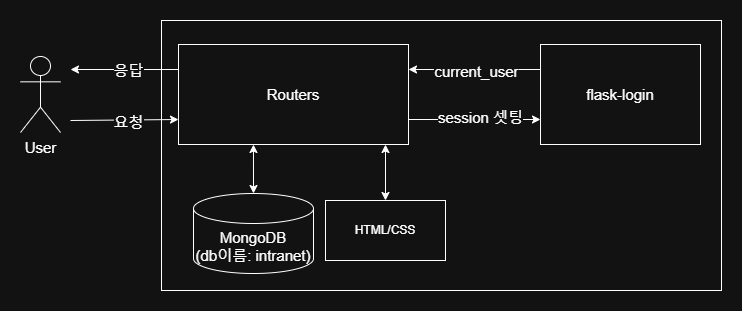
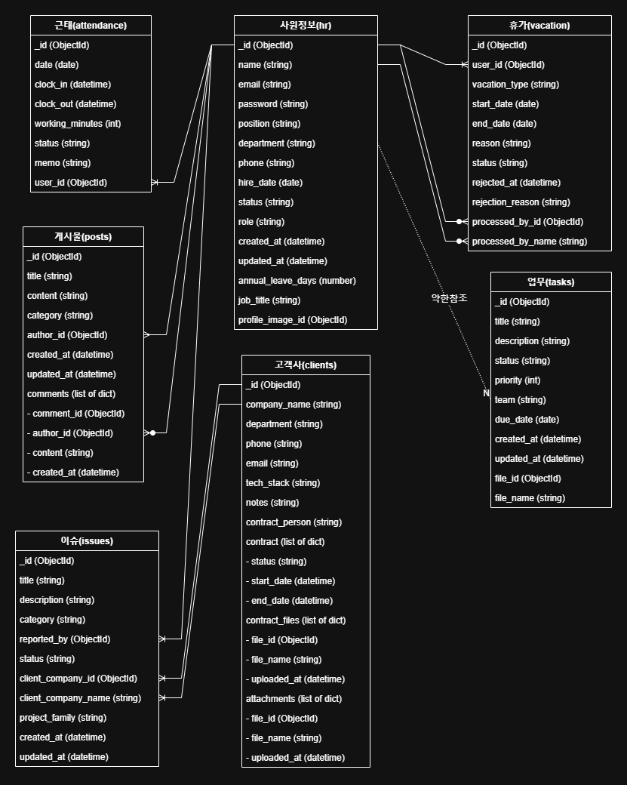

# 프로젝트 설명

파이썬의 Flask, pymongo 기반으로 만든 인트라넷입니다.

첫 프로젝트이신 분들도 계셔서 혼란스러워할까봐 MVC 패턴에서 Model은 사실상 빼고 View, Controller만 구현하였습니다.
또한 .env도 번거로울거같아 넣진않았습니다

팀원들이 각자 탭 하나씩 맡았고, 파일 이름도 직접 지었습니다.

---

# 기술 스택

- **Backend**: Python 3.10.11, Flask, PyMongo  
- **Frontend**: Jinja2 Template, HTML/CSS  
- **DB**: MongoDB  
- **패키지 관리**: Poetry

---

### 아키텍처 다이어그램

### intranet ERD

---

# 기능 및 파일 구조

## 📚 목차

- [베이스](#베이스)
- [🔐 인증](#-인증)
- [👤 인사관리 탭](#인사관리-탭)
- [🏢 고객사 관리 탭](#고객사-관리-탭)
- [🐞 이슈 관리 탭](#이슈-관리-탭)
- [📋 업무 관리 탭](#업무-관리-탭)
- [📝 커뮤니티 탭](#커뮤니티-탭)

---

## 베이스
- `templates/index.html` : 메인화면이자 간단한 인사 정도가 나오는 페이지  
- `templates/base.html` : 레이아웃을 담당하는 페이지  
  - 로그인 시 오른쪽 위에 프로필 사진과 로그아웃 버튼  
  - 각 페이지로 이동할 수 있는 탭이 존재  

---

## 🔐 인증

- `routes/auth_route.py` : 로그인, 로그아웃 관련 라우터  
- `templates/auth/login.html` : 로그인 화면 페이지  
- `templates/auth/register.html` : 회원가입 화면 페이지 (현재는 사용하지 않는 더미 페이지)  

---

## 인사관리 탭

### 내 휴가 신청 / 조회 (로그인 필수)
- `routes/hr/vc_route.py` : 휴가 신청 관련 라우터  
- `templates/hr/vc_list.html` : 휴가 신청 내역 페이지  
- `templates/hr/vc_apply.html` : 휴가 신청 페이지  
- `templates/hr/vc_edit.html` : 휴가 수정 페이지  

### 근태관리 (로그인 필수)
- `routes/hr/att_route.py` : 근태관리 관련 라우터  
- `templates/hr/attendance.html` : 근태관리 페이지  

### 직원정보관리 (로그인 필수, 권한: 'system', 'admin'만)
- `routes/hr/emp_admin_route.py` : 직원정보관리 관련 라우터  
- `templates/hr/emp_admin_list.html` : 직원 정보 리스트를 보여주는 페이지  
- `templates/hr/emp_profile.html` : 직원 정보를 수정하거나 생성하는 페이지  

### 인사통계 (로그인 필수, 권한: 'system', 'admin'만)
- `routes/hr/hr_stats_route.py` : 인사통계 관련 라우터  
- `templates/hr/hr_stats.html` : 인사통계 보여주는 페이지  

### 휴가 신청 관리 (로그인 필수, 권한: 'system', 'admin'만)
- `routes/hr/vc_admin_route.py` : 휴가 신청관리 관련 라우터  
- `templates/hr/vc_admin_list.html` : 휴가 신청 리스트 + 승인/거절 페이지  

---

## 고객사 관리 탭

### 고객사 조회 및 관리 (로그인 필수)
- `routes/client_route.py` : 고객사 조회 및 관리 관련 라우터  
- `templates/client/list.html` : 고객사 리스트를 보여주는 페이지  
- `templates/client/create.html` : 고객사 추가 페이지  
- `templates/client/detail.html` : 고객사 상세보기 페이지  
- `templates/client/edit.html` : 고객사 수정 페이지  

---

## 이슈 관리 탭

### 이슈 조회 및 관리 / 이슈 통계 (로그인 필수)
- `routes/issue_route.py` : 이슈 조회 및 관리 / 이슈 통계 관련 라우터  
- `templates/issue/index.html` : 이슈 메인화면 (간략하게 리스트를 보여줌)  
- `templates/issue/list.html` : 이슈 리스트를 보여주는 페이지  
- `templates/issue/detail.html` : 이슈 상세보기 페이지  
- `templates/issue/write.html` : 이슈 작성 페이지  
- `templates/issue/update.html` : 이슈 수정 페이지  
- `templates/issue/stats.html` : 이슈 통계 페이지 

---

## 업무 관리 탭

### 업무 조회 및 관리 / 업무 통계 (로그인 필수)
- `routes/task_route.py` : 업무 조회 및 관리 / 업무 통계 관련 라우터  
- `templates/task/add.html` : 업무 추가 페이지  
- `templates/task/edit.html` : 업무 수정 페이지  
- `templates/task/index.html` : 업무 리스트를 보여주는 페이지  
- `templates/task/stat.html` : 업무 통계를 보여주는 페이지  

---

## 커뮤니티 탭

### 게시판 (로그인 필수)
- `routes/write_route.py` : 커뮤니티의 게시판 관련 라우터  
- `templates/write/write.html` : 게시물 작성 페이지  
- `templates/write/index.html` : 게시물 리스트를 보여주는 페이지  
- `templates/write/detail.html` : 게시물 상세보기 페이지  
